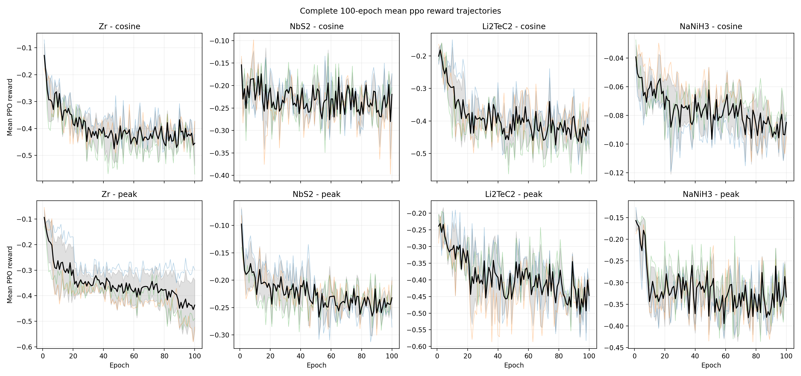
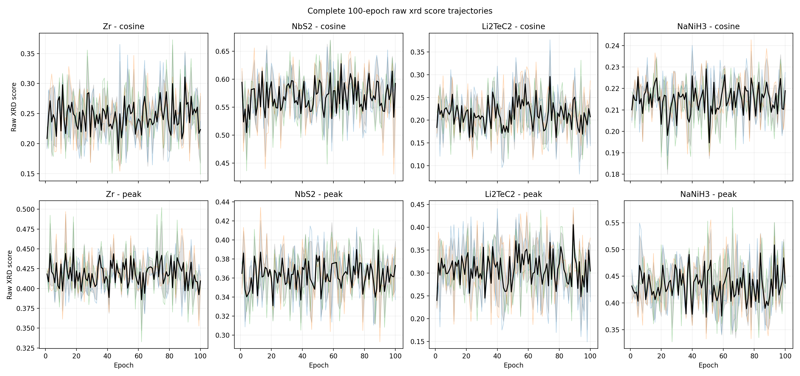
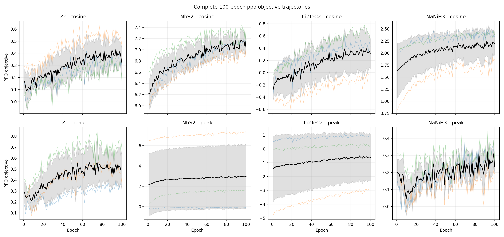
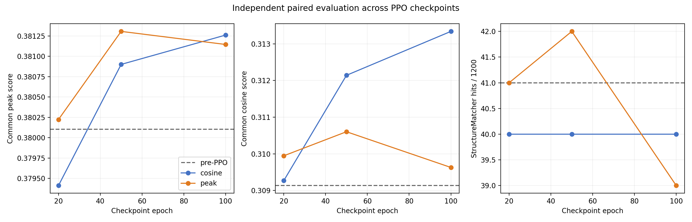

# DP Mask 与峰匹配 PPO：100 Epoch 完整实验报告

日期：2026-08-04

本报告只介绍本项目新增的方法、训练过程和实验结果，不介绍基座模型。

## 1. 先说结论

这次实验已经完整跑完，不再是早先的 20 epoch 小实验：

- `4` 种材料 × `2` 种 reward × `3` 个成对 seed = `24` 组；
- 每组完整 `100` epoch，每个 epoch 采样 `8` 个训练候选；
- 共 `2400` 个正式 epoch、`19200` 个训练候选和 `240` 个 checkpoint；
- epoch `20/50/100` 共评估 `72` 个 checkpoint，每个生成 `100` 个未见样本，共 `7200` 个；
- 另有共同 pre-PPO 基线 `1200` 个样本用于同条件比较。

实验得到三个清楚的结论：

1. **DP Mask 稳定解决了化学式约束。** 正式训练的 `19200/19200` 个候选、独立评估的 `7200/7200` 个候选都满足指定化学式。早期 12 材料实验也是 `2400/2400`。
2. **峰匹配评分器的离线排序优势成立。** 在完全相同的候选池中，正确结构 Top-1/Top-5/Top-10 从余弦评分的 `9/12、9/12、9/12` 提高到 `10/12、11/12、12/12`。
3. **峰评分作为 PPO reward 训练 100 epoch 后，没有形成可统计确认的生成优势。** epoch 100 独立测试中，峰 PPO 与余弦 PPO 的共同峰分差为 `-0.000116`，精确配对检验 `p=0.967`；StructureMatcher 为 `39/1200` 对 `40/1200`。二者也没有显著优于 pre-PPO 的 `41/1200`。

最严谨的一句话是：

> DP Mask 的约束效果已经成立，峰评分的排序效果已经成立；但当前 PPO 配置没有把评分器优势转化成稳定的结构生成优势，增加到 100 epoch 也没有改变这个结论。

## 2. 项目做了什么

项目处理两个不同问题：

- **化学式可行性：** 生成过程中不能走进“剩余位置已不可能补成目标比例”的死路；
- **XRD 评价：** 实验谱有噪声、背景和峰展宽，整曲线余弦相似度可能低估峰位正确的结构。

对应的两个核心方法是：

- 用动态规划可达性 Mask，提前屏蔽无法完成目标化学式的动作；
- 用一对一峰匹配分数代替单纯的整曲线余弦分数，并把两种分数分别用于成对 PPO 实验。

## 3. 方法一：动态规划 Mask

### 3.1 通俗解释

每次选择空间群、Wyckoff 位或元素前，DP 都先向后检查：选择这个动作后，剩余位置是否仍能恰好补成目标元素比例。

- 还能补完：允许选择；
- 一定补不完：立即屏蔽；
- 只有组成目标比例的某个整数倍时，才允许合法结束。

采样和 PPO 回放重算 log-prob 使用同一套动态动作集合，避免“采样时允许、训练时不允许”的策略不一致。

### 3.2 形式化表示

设目标最简比例为 `r=(r_1,...,r_m)`，当前元素计数为 `c`，动作 `a` 后计数为 `c'`，原子数上限为 `N_max`。动作 Mask 可写为：

```text
M(a | state) = 1，当且仅当存在整数 k >= 1，使得：
               c'_i <= k r_i，sum(k r_i) <= N_max，
               且剩余合法 Wyckoff multiplicity 能恰好填满 k r - c'。
```

DP 保证的是“仍存在完成化学式的路线”，不保证晶格合理、结构稳定、拓扑正确或候选唯一。

### 3.3 实测效果

| 数据 | 候选数 | 化学式正确 | 几何/CIF/XRD 有效 | StructureMatcher |
|---|---:|---:|---:|---:|
| 早期 12 材料固定 checkpoint | 2400 | 2400（100%） | 2389（99.54%） | 48（2.00%） |
| 本次 100-epoch 正式训练 | 19200 | 19200（100%） | 18840 个 CIF | 未逐个统一计算 |
| pre-PPO 独立基线 | 1200 | 1200（100%） | 1171（97.58%） | 41（3.42%） |
| epoch 100 余弦 PPO | 1200 | 1200（100%） | 1170（97.50%） | 40（3.33%） |
| epoch 100 峰 PPO | 1200 | 1200（100%） | 1171（97.58%） | 39（3.25%） |

这说明 DP 的目标确实实现了，但“化学式正确”与“结构正确”是两件事。

## 4. 方法二：统一峰匹配评分

### 4.1 通俗解释

旧评分比较整条理论谱和实验谱；新评分先提取主要峰，允许有限的整体 q 尺度修正和小零点平移，然后一对一匹配峰。漏峰、多峰和峰位偏差都会扣分。

### 4.2 总公式

目标峰 `i` 和候选峰 `j` 的匹配权重为：

```text
w_ij = sqrt(sqrt(I_i) * sqrt(J_j))
       * exp[-0.5 * ((q'_j - q_i) / delta_q)^2]

q'_j = a q_j + b
```

所有峰只能一对一匹配。再定义加权 precision、recall 和最终单一分数：

```text
P = sum(matched w_ij) / sum_j sqrt(J_j)
R = sum(matched w_ij) / sum_i sqrt(I_i)
S_peak = 2PR / (P + R)
```

最终选择允许范围内使 `S_peak` 最大的 `(a,b)`。分数范围为 `[0,1]`。当前主要设置为：峰高阈值 `0.08`、prominence `0.05`、检测平滑 `0.10` 度、最小峰距 `0.15` 度、q 容差 `0.04`、尺度范围 `0.70–1.40`、零点平移绝对值不超过 `0.03`、最多 40 个峰。

### 4.3 相同候选池排序结果

12 个真实实验 opXRD 目标使用完全相同的候选池，并额外注入已知正确结构：

| 正确结构排名 | 余弦评分 | 峰匹配评分 |
|---|---:|---:|
| Top-1 | 9/12（75.0%） | 10/12（83.3%） |
| Top-5 | 9/12（75.0%） | 11/12（91.7%） |
| Top-10 | 9/12（75.0%） | 12/12（100%） |

代表性变化：NbS2 `187 -> 1`、Ti `78 -> 3`、Li2TeC2 `34 -> 9`。

这是评分器的同池排序证据，不等于模型生成出了正确结构，也不等于 PPO 有效。

## 5. PPO reward 与损失函数

### 5.1 从 XRD 分数到 reward

第 `t` 轮候选的原始相似度为 `S_t(x)`，截至当前见过的最高分为 `M_t`：

```text
M_t = max(M_(t-1), max_x S_t(x))
R_t(x) = S_t(x) - M_t <= 0
```

reward 为 0 表示达到当前历史最好值；越负表示离历史最好值越远。EMA baseline 与 advantage 为：

```text
B_1 = mean(R_1)
B_t = 0.95 B_(t-1) + 0.05 mean(R_t)
A_t(x) = R_t(x) - B_t
```

因此 reward 变得更负，不等于原始 XRD 分数一定下降。随着训练时间增加，历史最大值更容易被偶然高分抬高，后续 reward 的参照也会更严格。

### 5.2 PPO 总目标

设当前策略为 `pi_theta`，本轮采样旧策略为 `pi_old`，共同训练前策略为 `pi_0`：

```text
rho_t(theta) = exp[log pi_theta(x_t) - log pi_old(x_t)]
K_t = log pi_theta(x_t) - log pi_0(x_t)
A'_t = A_t - beta K_t - alpha log pi_theta(x_t)

J(theta) = mean[min(rho_t A'_t,
                    clip(rho_t, 1-epsilon, 1+epsilon) A'_t)]
           + gamma * mean[log pi_theta(x_buffer)]
```

代码通过反转梯度来**最大化** `J(theta)`；若写成常见的最小化损失，则：

```text
L(theta) = -J(theta)
```

日志中的 `ppo_objective` 是 `J(theta)`，不是 `L(theta)`。`log_ratio_to_reference` 是样本上的 `log pi_theta-log pi_0` 均值，不是保证非负的解析 KL。

本次固定参数：`epsilon=0.2`、`beta=0.1`、`alpha=0`、`gamma=0.1`。

## 6. 正式训练协议

| 项目 | 设置 |
|---|---|
| 材料 | Zr、NbS2、Li2TeC2、NaNiH3 |
| reward | 余弦、峰匹配 |
| seed | 每种材料 3 个成对 seed |
| 正式运行 | `4 × 2 × 3 = 24` |
| 每组 | 100 outer epochs |
| 每轮候选 | 8 |
| 每组候选 | 800 |
| 总候选 | 19200 |
| PPO 更新 | 每轮 1 次，共 2400 次 |
| PPO microbatch | 2；4 个微批梯度求平均后只更新 1 次 |
| optimizer / learning rate | Adam / `5e-7` |
| PPO epochs | 1 |
| DP 原子上限 / size bias | 40 / 0.5 |
| checkpoint | 每 10 epoch，共 240 个 |
| 共同起点 | 同一个 pre-PPO checkpoint |

严格审计结果：24 组均为 100 行，2400 个 score CSV、240 个结构完整的 checkpoint，所有 epoch 的 `attempt=8`，错误数为 0。中断运行全部位于 `interrupted_audit`，没有拼接进正式曲线。

## 7. 100 epoch 训练曲线

### 7.1 完整 reward 曲线



最简单的解释是：**reward 有明显噪声，并且总体越来越负，没有出现持续向 0 收敛的趋势。**

| reward 方法 | 前 20 epoch 平均 | 后 20 epoch 平均 | 后减前 |
|---|---:|---:|---:|
| 余弦 | -0.21841 | -0.29594 | -0.07753 |
| 峰匹配 | -0.25251 | -0.36031 | -0.10780 |

24 组中，每种材料、每种 reward 的 3/3 seed，后 20 epoch reward 都比前 20 epoch 更负。主要原因是 reward 相对累计历史最好值计算，不能把它直接解释成原始结构质量持续下降。

### 7.2 原始 XRD 分数



原始分数整体基本横盘：

| reward 方法 | 前 20 epoch | 后 20 epoch | 后减前 | 上升运行数 |
|---|---:|---:|---:|---:|
| 余弦 | 0.31027 | 0.31110 | +0.00082 | 5/12 |
| 峰匹配 | 0.37969 | 0.37977 | +0.00008 | 8/12 |

余弦分与峰分量纲和定义不同，不能用两行绝对值直接比较哪种模型更好；这里只能在各自方法内部看前后变化。

逐材料的“后 20 减前 20”如下：

| 材料 | 余弦 raw | 峰 raw | 余弦 reward | 峰 reward |
|---|---:|---:|---:|---:|
| Zr | +0.00138 | -0.00235 | -0.12840 | -0.16665 |
| NbS2 | +0.00911 | +0.00002 | -0.02855 | -0.05448 |
| Li2TeC2 | -0.00644 | -0.00222 | -0.12535 | -0.14558 |
| NaNiH3 | -0.00075 | +0.00487 | -0.02783 | -0.06448 |

只有 3 个 seed，bootstrap 区间很宽；这些训练内 raw 变化不能代替独立测试。

### 7.3 PPO objective



| reward 方法 | 前 20 epoch | 后 20 epoch | 后减前 |
|---|---:|---:|---:|
| 余弦 | 2.08774 | 2.49374 | +0.40600 |
| 峰匹配 | 0.40922 | 0.76681 | +0.35759 |

24/24 组的后 20 epoch objective 都高于前 20 epoch，说明优化器确实在提高代码定义的 PPO 目标；但原始分数基本横盘，独立测试也没有同步提高。因此“objective 上升”只能证明优化发生了，不能证明生成质量改善。

不同材料的 log-prob 尺度差异很大，不能横向比较 objective 的绝对值。

### 7.4 失败率与多样性

- 余弦训练：`9412/9600` 个 CIF，零分 `201/9600`；
- 峰训练：`9428/9600` 个 CIF，零分 `389/9600`；
- 合计：`18840/19200` 个 CIF，零分 `590/19200`；
- 每轮平均唯一 `(Wyckoff, element)` 组合随材料而不同，但完整曲线没有显示统一的策略坍缩到单一组合；
- 峰方法零分更多，主要集中在复杂的 Li2TeC2，说明峰检测/有效谱失败仍会提高 reward 方差。

每种材料的 6 条独立 seed 完整曲线：

- [Zr](peak_ppo_100epoch_20260804/PPO_100_COMPLETE_Zr.png)
- [NbS2](peak_ppo_100epoch_20260804/PPO_100_COMPLETE_NbS2.png)
- [Li2TeC2](peak_ppo_100epoch_20260804/PPO_100_COMPLETE_Li2TeC2.png)
- [NaNiH3](peak_ppo_100epoch_20260804/PPO_100_COMPLETE_NaNiH3.png)

## 8. epoch 20/50/100 独立评估

### 8.1 评估设计

每个 checkpoint 用未参与训练的配对 test seed 生成 100 个候选。统一重新计算：

- common peak score；
- common cosine score；
- 化学式正确数；
- 有效 XRD 数；
- StructureMatcher 命中数。

正式评估为 `4 材料 × 2 reward × 3 seed × 3 checkpoint = 72` 组，共 `7200` 个未见样本。pre-PPO 用相同的 12 个 test seed 生成 `1200` 个基线样本。



### 8.2 总体结果

每行都是 12 个 test seed、1200 个候选。

| 模型 | epoch | 化学式 | 有效 XRD | common peak | common cosine | StructureMatcher |
|---|---:|---:|---:|---:|---:|---:|
| pre-PPO | 0 | 1200/1200 | 1171 | 0.380104 | 0.309136 | 41 |
| 余弦 PPO | 20 | 1200/1200 | 1168 | 0.379411 | 0.309270 | 40 |
| 峰 PPO | 20 | 1200/1200 | 1169 | 0.380223 | 0.309947 | 41 |
| 余弦 PPO | 50 | 1200/1200 | 1166 | 0.380901 | 0.312142 | 40 |
| 峰 PPO | 50 | 1200/1200 | 1172 | 0.381307 | 0.310604 | 42 |
| 余弦 PPO | 100 | 1200/1200 | 1170 | 0.381261 | 0.313340 | 40 |
| 峰 PPO | 100 | 1200/1200 | 1171 | 0.381146 | 0.309629 | 39 |

### 8.3 峰 PPO 与余弦 PPO 的配对比较

| epoch | common peak 差（峰-余弦） | 精确 p | StructureMatcher（峰/余弦） |
|---:|---:|---:|---:|
| 20 | +0.000812 | 0.555 | 41 / 40 |
| 50 | +0.000406 | 0.851 | 42 / 40 |
| 100 | -0.000116 | 0.967 | 39 / 40 |

没有一个 checkpoint 的共同峰分差达到统计显著。epoch 100 的 common cosine 差为 `-0.003711`，`p=0.061`，方向反而更偏向余弦 PPO，但仍未达到常用 0.05 阈值。

与 pre-PPO 比较，epoch 100：

- 峰 PPO common peak `+0.001041`，`p=0.720`；StructureMatcher `39 vs 41`；
- 余弦 PPO common peak `+0.001157`，`p=0.586`；StructureMatcher `40 vs 41`。

因此不能声称任一 PPO 方法在结构恢复上优于 pre-PPO。

### 8.4 100 epoch 是否比 20 epoch 更好

使用相同 test seed 对 epoch 100 与 epoch 20 做配对比较：

| 方法 | common peak 变化 | 精确 p | common cosine 变化 | 精确 p | StructureMatcher 变化 |
|---|---:|---:|---:|---:|---:|
| 余弦 PPO | +0.001850 | 0.034 | +0.004070 | 0.042 | 0 |
| 峰 PPO | +0.000923 | 0.679 | -0.000318 | 0.851 | -2 |

余弦 PPO 的两个连续分数有小幅配对提升，但没有增加正确结构命中；这里还涉及多个指标比较，不能把未校正的 `p<0.05` 解释成全面成功。峰 PPO 从 20 延长到 100 epoch 没有显著分数提升，结构命中由 41 降到 39。

### 8.5 逐材料的结构覆盖

epoch 100 每种材料均为 300 个独立候选：

| 材料 | pre-PPO | 余弦 PPO | 峰 PPO |
|---|---:|---:|---:|
| Zr | 5 | 5 | 5 |
| NbS2 | 0 | 0 | 0 |
| Li2TeC2 | 0 | 0 | 0 |
| NaNiH3 | 36 | 35 | 34 |

NbS2 与 Li2TeC2 的主要瓶颈仍是候选拓扑覆盖，而不是从已有正确候选中排序。NaNiH3 贡献了绝大多数命中，但 PPO 没有提高其命中数。

## 9. 为什么排序有效，PPO 却没有明显改善

这两个结果并不矛盾：

- 同池 A/B 直接检验“正确结构已经在候选池中时能否排得更靠前”；
- PPO 每轮只有 8 个新候选，若正确拓扑没有采到，再好的评分器也无法直接优化它；
- 峰分允许有限尺度和零点对齐，可能给“峰能对上但拓扑不对”的结构较高分；
- batch 8 时 replay buffer 只保留 1 个历史高 reward 候选，容易受偶然高分影响；
- reward 相对累计历史最好值计算，导致训练越久 reward 基准越严格；
- objective 能被优化，但这不保证原始 XRD 或 StructureMatcher 同步改善。

所以当前问题不是简单的“epoch 不够”。100 epoch 的完整结果表明，继续机械增加 epoch 很可能只会增加计算量，而不会自动解决候选覆盖和 reward 方差。

## 10. 运行安全与实验审计

实验期间一次 WSL/Windows 崩溃被 Windows 事件日志定位为宿主提交内存/pagefile 不足，不是 PPO 数值错误。之后采取了以下措施：

- E 盘 pagefile 设置为初始 `24 GB`、最大 `32 GB`；
- Windows 宿主提交内存保护与 Linux available/swap 保护同时运行；
- 每次只串行运行一个模型；
- checkpoint 使用临时文件、`fsync` 和原子替换；
- 后续 checkpoint 仅保存 `params`，约 `53 MiB`，不再保存 Adam moments；
- 所有中断组整体隔离，始终从共同 pre-PPO checkpoint 重新跑完整 100 epoch。

最终正式矩阵没有包含任何半截曲线。需要说明：params-only checkpoint 足够做采样和评估，但不能精确恢复 Adam optimizer 状态，因此不能用于无缝续训。

## 11. 证据边界

本次可以确认：

- DP 在所有正式训练与独立评估样本中实现 100% 化学式正确；
- 峰评分在相同候选池上的正确结构 Top-k 排序优于余弦；
- 100 epoch、24 组 PPO 训练和 7200 样本 checkpoint 评估均完整完成；
- 峰 PPO 在 epoch 20/50/100 都没有显著优于余弦 PPO；
- 两种 PPO 的 StructureMatcher 命中都没有优于 pre-PPO；
- 延长到 100 epoch 没有解决峰 PPO 的生成效果问题。

本次没有进行 MLFF 松弛、能量稳定性、热力学凸包或 DFT，因此不能声称候选稳定。高 XRD 分不等于正确拓扑；注入真实 CIF 的排名也不等于模型成功生成了该结构。

## 12. 数据与图表

- 严格训练审计：`issue68_xrd_recovery/experiments/peak_ppo_100epoch_20260803/formal/STRICT_TRAINING_AUDIT.json`
- 2400 轮逐 epoch 数据：`reports/peak_ppo_100epoch_20260804/PPO_100_EPOCH_METRICS.csv`
- 24 组训练汇总：`reports/peak_ppo_100epoch_20260804/PPO_100_RUN_SUMMARY.csv`
- 前后变化及 bootstrap 区间：`reports/peak_ppo_100epoch_20260804/PPO_100_WITHIN_METHOD_CHANGES.csv`
- 10-epoch 分段统计：`reports/peak_ppo_100epoch_20260804/PPO_100_SEGMENT_SUMMARY.csv`
- 72 组 checkpoint 独立结果：`issue68_xrd_recovery/experiments/peak_ppo_100epoch_20260803/checkpoint_evaluation/CHECKPOINT_EVALUATION_SUMMARY.csv`
- 独立评估方法汇总：`reports/peak_ppo_100epoch_20260804/checkpoint_evaluation/PPO_CHECKPOINT_MODEL_SUMMARY.csv`
- 配对差值与精确检验：`reports/peak_ppo_100epoch_20260804/checkpoint_evaluation/PPO_CHECKPOINT_COMPARISONS.csv`
- 同池评分 A/B：`reports/XRD_SCORE_AB_SAME_POOL.csv`
